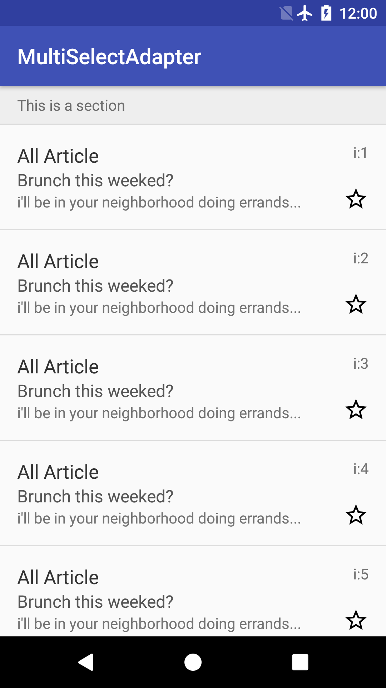
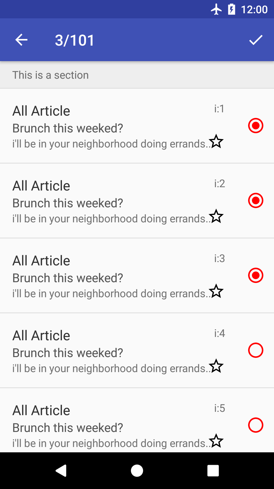
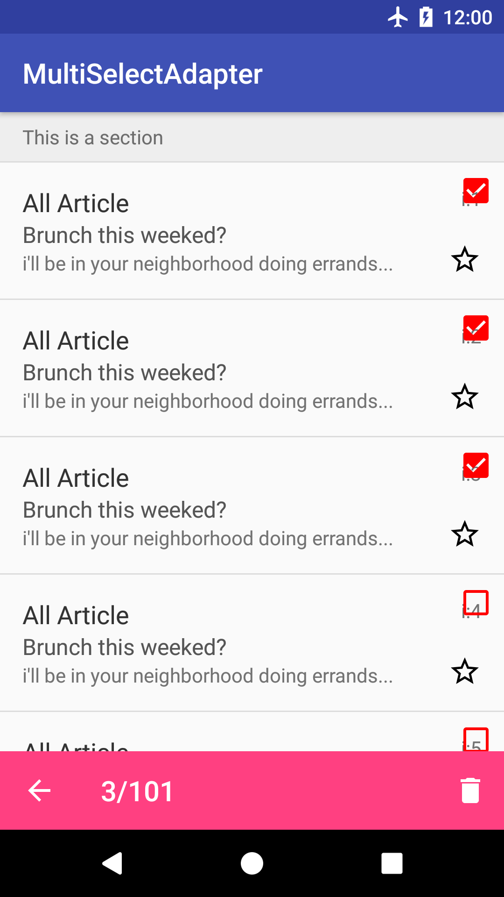
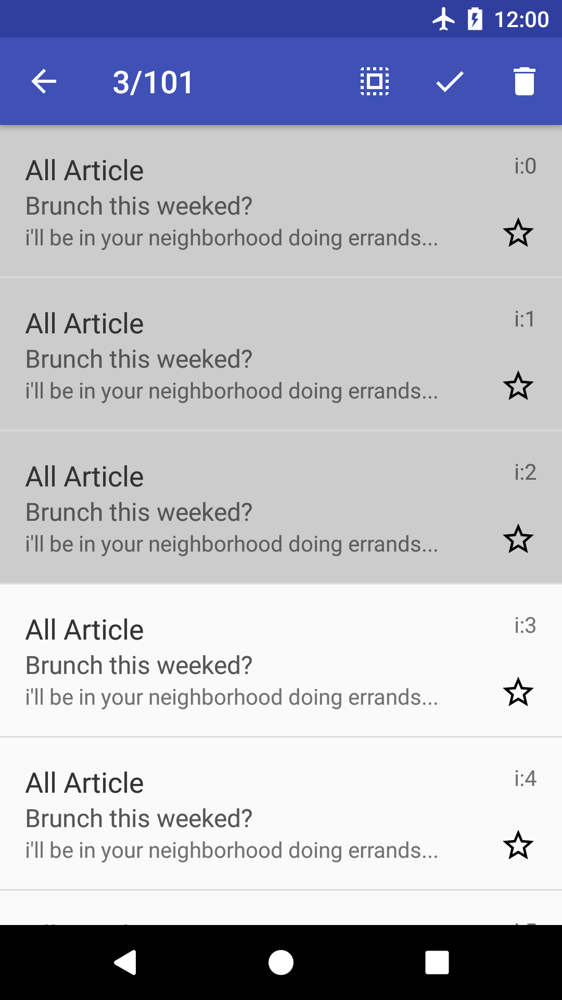
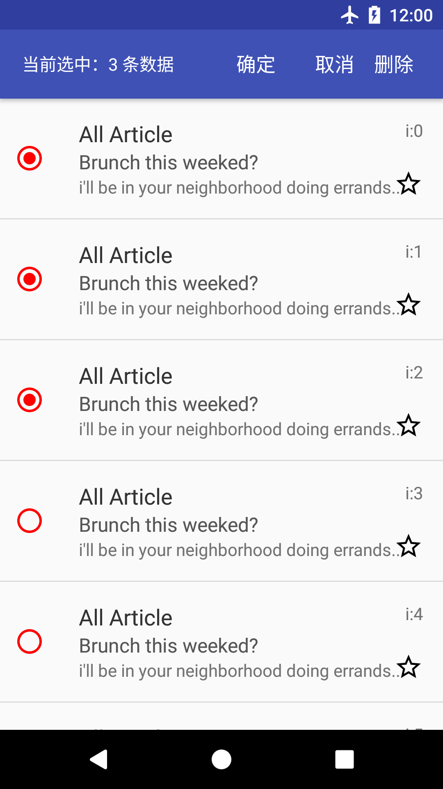
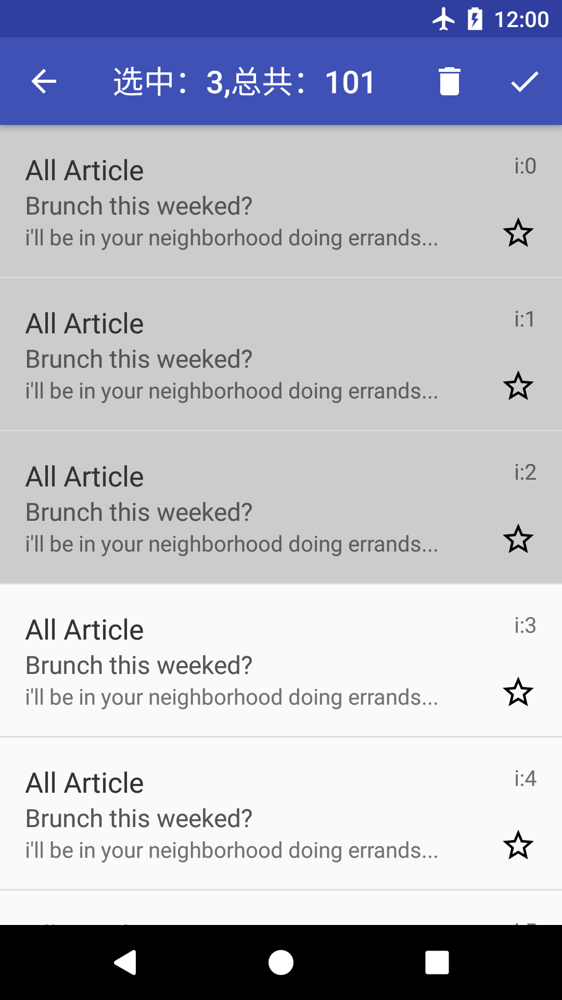
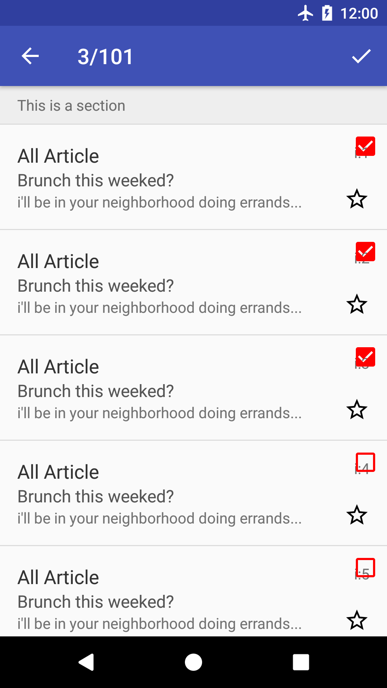
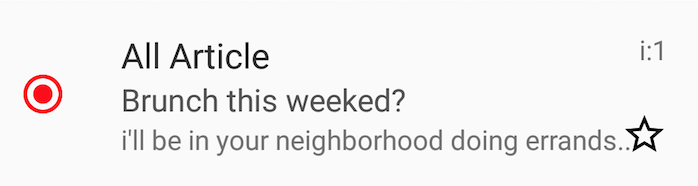

# MultiSelectAdapter

MultiSelectAdapter是一个为RecyclerView设计的Adapter，它可以在不修改你原有Adapter的前提下让你的RecycleView支持多选和批量操作

## Demo

<table>
<tr>
<td>
<td>
<td>
<td>
</tr>
<tr>
<td>
<td>
<td>
<td>
</tr>
</table>

## Compile
[](https://jitpack.io/#goyourfly/MultiSelectAdapter)

Step 1. Add it in your root build.gradle at the end of repositories:

````
allprojects {
    repositories {
        ...
        maven { url 'https://jitpack.io' }
    }
}
````

Step 2. Add the dependency

````
dependencies {
    compile 'com.github.goyourfly:MultiSelectAdapter:3.6'
}
````


## Usage

````java
 MultipleAdapter adapter = MultipleSelect
                .with(Activity)
                .adapter(YourAdapter)
                .ignoreViewType(ItemViewType)
                .linkList(YourAdapter.list)
                .stateChangeListener(StateChangeListener)
                .decorateFactory(? extends DecorateFactory)
                .customMenu(? extends MenuBar)
                .build();
````

| 方法名 | 形参 | 是否必须 | 说明 |
|:-----|:-----|:-----|:-----|
| with | Activity | 是 | 显示RecycleView的Activity |
| adapter | RecyclerView.Adapter | 是 | 你的Adapter |
| ignoreViewType | Integer[] | 否 | 需要忽略的Item类型，比如Section，Header，Footer等 |
| linkList | List<Object> | 否 | 绑定你的Adapter的地址，这样在调用MultipleAdapter.delete()接口的时候就会自动删除数据 |
| stateChangeListener | StateChangeListener | 否 | 选择模式时候的一些消息回调 |
| decorateFactory | ? extends DecorateFactory | 否 | 选择模式时Item的样式创建类，可以自定义，具体样式参考上面Demo，底下会详细介绍 |
| customMenu | ? extends MenuBar | 否 | 选择模式的Menu，默认提供几种方式，可以简单的自定义和完全的自定义 |

### StateChangeListener

````kotlin
/**
 * Kotlin
 * 一些操作的回调
 */
open class SimpleStateChangeListener:StateChangeListener{
    override fun onSelectMode() {

    }

    override fun onSelect(position: Int, selectNum: Int) {

    }

    override fun onUnSelect(position: Int, selectNum: Int) {

    }

    override fun onDone(array: ArrayList<Int>) {

    }

    override fun onDelete(array: ArrayList<Int>) {

    }

    override fun onCancel() {

    }

}
````

### DecorateFactory

DecorateFactory定义了在多选模式下Item的样式，如下第一个是正常模式的显示状态，第二个是多选模式下的显示样式（其中的一种样式）




目前内置四种样式的DecorateFactory，分别是

| 类名 | 构造方法参数 | 说明 | Demo | 
|:-----|:-----|:------|:-----|
| RadioBtnFactory | color:Int(RadioBtn颜色), duration:Long(动画时长), gravity:Int(位置，Gravity.LEFT,Gravity.RIGHT) | 在Item外面的左侧或者右侧显示RadioButton ||
| CheckBoxFactory | color:Int(颜色), duration:Long(动画时长), gravity:Int(位置，Gravity)，marginDp:Int，边距 | 在Item内部的左侧或者右侧显示RadioButton， ||
| ColorFactory | targetViewId:Int(改变颜色的View ID)，defaultColor:Int，普通状态下的颜色，selectColor:Int选中状态下的颜色 |    选中和未选中的时候，修改某一个View的背景色 | |
| DrawableFactory | | | |

##### 当然，你也可以实现自己的风格如下：

````kotlin
class YourCustomFactory(val color: Int = Color.RED,
                      val gravity: Int = Gravity.RIGHT,
                      val marginDp:Int = 8) : CustomViewFactory() {
    // 显示时候的动画，如果不加动画，则直接将selectView置为View.VISIBLE
    override fun onShowAnimation(itemView: View, selectView: View) {
        selectView.visibility = View.VISIBLE
    }

    // 隐藏时候的动画，如果不加动画，则直接将selectView置为View.GONE
    override fun onHideAnimation(itemView: View, selectView: View) {
        selectView.visibility = View.GONE
    }

	// 创建选中时显示的View
    override fun onCreateSelectView(context:Context): View {
        val imageView = ImageView(context)
        imageView.setImageResource(R.drawable.ic_check_box_black_24dp)
        imageView.setColorFilter(color)
        return imageView
    }
	// 创建未选中时的View
    override fun onCreateNormalView(context:Context): View {
        val imageView = ImageView(context)
        imageView.setColorFilter(color)
        imageView.setImageResource(R.drawable.ic_check_box_outline_blank_black_24dp)
        return imageView
    }

	// 创建View的容器，该容器包含了用户的ItemView和你定义的选中时的View
    override fun onCreateRootView(context:Context): ViewGroup {
        return FrameLayout(context)
    }

	// 设置ItemView和SelectView的位置关系
	// ItemView:用户创建的ItemView
	// SelectView:选中状态View
    override fun onBindSelectView(root: ViewGroup, itemView: View, selectView: View) {
        root.removeAllViews()
        root.addView(itemView)
        val params = FrameLayout.LayoutParams(FrameLayout.LayoutParams.WRAP_CONTENT, FrameLayout.LayoutParams.WRAP_CONTENT)
        params.gravity = gravity
        params.leftMargin = marginDp.toPx(root.context)
        params.topMargin = marginDp.toPx(root.context)
        params.rightMargin = marginDp.toPx(root.context)
        params.bottomMargin = marginDp.toPx(root.context)
        root.addView(selectView, params)
    }

}

````

### MenuBar


内置四种MenuBar的样式，具体样式请看Demo

- SimpleDeleteMenuBar
- SimpleDoneMenuBar
- SimpleDoneAndDeleteMenuBar
- SimpleDeleteSelectAllMenuBar

你也可以通过继承CustomMenuBar来实现一个自己的MenuBar：

````kotlin
class MyMenuBar(activity:Activity,menuId:Int,color:Int)
        :CustomMenuBar(activity,menuId,color,Gravity.TOP){

    override fun onUpdateTitle(selectCount: Int, total: Int) {
        toolbar.title = "选中：$selectCount 总共：$total"
    }

    override fun onMenuItemClick(menuItem: MenuItem, controller: MenuController) {
        //TODO 这里处理点击事件
    }
}
````

#### 详细的使用可以看这里：[Code](./app/src/main/java/com/goyourfly/multiselectadapter/)