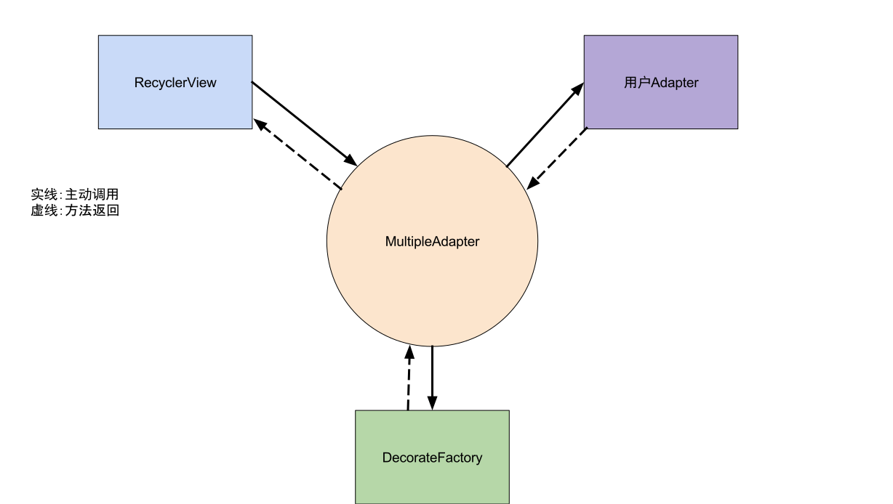
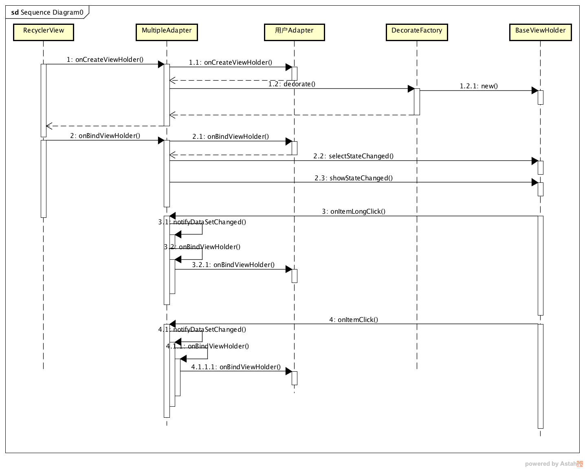

### 一行代码实现RecyclerView的多选模式

[MultiSelectAdapter项目地址](https://github.com/goyourfly/MultiSelectAdapter)
### 装B部分
>在Android上古时代，如果人类想要实现列表展示，需要用到ListView，虽然用起来很简单，但是很不灵活，随后，Google推出了新的替代品RecyclerView，那RecyclerView确实很灵活，只有你想不到的没有它做不到的，但是呢，天下没有免费的午餐，灵活带来的代价就是更多的Coding，我觉得灵活的本质就是只抽象更底层的逻辑，至于具体的场景就由你们这些码农去做吧，哈哈哈...

依稀记得，在ListView的时代，多选是ListView自带的功能，Item的点击回调也是自带的功能，用起来还算方便，但是到了RecyclerView的时代呢，虽然很灵活，但是一切都得自己去实现，多选就是其中需要自己实现的功能之一。

据我了解，如果你想在RecyclerView上实现多选功能，正规的做法是

1. 在定义Item的时候，要把`选中状态View埋进Item的布局中`
2. 在Adapter中定义一个全局变量暂且叫`isSelectMode`来表示当前状态
3. 在Adapter中定义一个记录选中状态的集合（HashMap或SparseBooleanArray）
4. 监听Item的点击事件，被点击时往上面的集合中插入选中或者未选中记录
5. 刷新列表，在onBindViewHolder中显示选中或未选中的标记
6. ...

可以看到，我只想实现一个简单的多选却要写这么多的代码，着实很码农

为了解决这个问题，我设计了一个Library，可以通过一行代码实现从一个普通的RecyclerView到一个支持多选的RecyclerView的华丽转换

✨✨✨✨✨✨✨✨✨✨✨✨✨✨✨✨✨✨✨✨✨✨✨

✨✨✨✨✨✨✨<font color="RED"> MultiSelectAdapter </font>✨✨✨✨✨✨✨✨✨

✨✨✨✨✨✨✨✨✨✨✨✨✨✨✨✨✨✨✨✨✨✨✨

虽然名字很土，但是用起来很舒服🙂，谁用谁知道

“那怎么使用呢？真的只需要一行代码就能实现吗？”

“额，O__O "… 其实，理论上讲，不管什么程序，都可以一行搞定，不是吗？”

“💩”

先说一下具体的怎么使用吧

### 使用介绍
````java
recycler.adapter = MultipleSelect.with(Activity).adapter(YourAdapter).build();
````

对应的显示效果如下：


我擦嘞，还真的是一行耶，不过，如果你想要更多不同的显示效果，就得多敲几行了，具体怎么使用我就不多bb了，本文主要想讲一讲这个Library的源码部分，
##### 至于使用方法请看这里，写的很详细，喜欢的话请记得点个Star：[MultiSelectAdapter项目地址](https://github.com/goyourfly/MultiSelectAdapter)

### 源码部分
[MultiSelectAdapter源码](https://github.com/goyourfly/MultiSelectAdapter/tree/master/library/src/main/java/com/goyourfly/multiple/adapter)

[时序图](#toc_14)

其实这个项目本身没有用到任何复杂的技术，都是些很常用的东西，只不过是对普普通通的一些代码的封装，我觉得作为程序员，对语言使用的熟练度，高级的技巧固然重要，但更重要的是封装的思想，这种思想是通用的，这就像我们学习外语，会很多单词，很多句式，很多语法结构很重要，但是如果不能用这些学到的东西来准确的表达你的意思，那学这些也没有意义。


##### 整体结构：


从上面的图可以看出MultipleAdapter使用装饰模式，将用户的Adapter进行加工，然后将装饰后的ViewHolder返回RecyclerView，而装饰的具体过程交给DecorateFactory执行。

##### 
了解了大体的结构以后，我们去看看代码吧，老规矩，从使用的角度入手，一步一步的来吧。

````java
 MultipleAdapter adapter = MultipleSelect
                .with(Activity)
                .adapter(YourAdapter)
                .ignoreViewType(ItemViewType)
                .stateChangeListener(StateChangeListener)
                .decorateFactory(? extends DecorateFactory)
                .customMenu(? extends MenuBar)
                .build();
````
>这个项目代码是Kotlin写的，跟Java大同小异，应该没什么阅读障碍吧

首先看看 
#### MultipleSelect

MultipleSelect是一个单例，主要是为了构造MultipleAdapter，通过Builder模式，方便用户传入初始化的配置，其中主要的参数有：

| 参数 | 类型 | 说明 |
|:---|:---|:---|
| adapter | RecyclerView.Adapter | 用户定义的Adapter |
| ignoreViewType | Integer[] | 忽略多选的ItemViewType |
| decorateFactory | DecorateFactory | 多选样式生成器 |
| customMenu | MenuBar | 自定义的MenuBar，一般继承CustomMenuBar，传入menu id |
| stateChangeListener | StateChangeListener | 一些回调 |

最后通过build()方法构造一个MultipleAdapter并将用户的配置通过构造方法传入参数

#### MultipleAdapter

````kotlin
/**
 * val开头代表这个是常量
 * 该类继承自RecyclerView.Adapter，
 * 同时持有用户的Adapter，利用装饰者
 * 模式，对用户的Adapter进行加工
 */
class MultipleAdapter(val adapter: RecyclerView.Adapter<RecyclerView.ViewHolder>,
                      val stateChangeListener: StateChangeListener?,
                      val popupToolbar: MenuBar?,
                      val ignoreType: Array<Int>?,
                      val decorateFactory: DecorateFactory,
                      val duration: Long) : RecyclerView.Adapter<RecyclerView.ViewHolder>(), MenuController {
	// showState一共有四种：默认，默认到选择，选择，选择到默认
	var showState = ViewState.DEFAULT
	// 记录选中状态的数组
	val selectIndex = SparseBooleanArray()
	var selectNum = 0
}
````

##### MultipleAdapter.onCreateViewHolder

````kotlin
override fun onCreateViewHolder(viewGroup: ViewGroup, position: Int): RecyclerView.ViewHolder {
	// 通过调用用户的Adapter，生成原始的ViewHolder
    val outerHolder = adapter.onCreateViewHolder(viewGroup, position)
    // 判断这个ViewHolder是否允许多选
    // 如果是否，则直接返回用户的ViewHolder即可
    if (isIgnore(position))
        return outerHolder
    // 否则，通过decorateFactory对outerHolder加工
    return decorateFactory.decorate(outerHolder, this)
}
````
>暂时先跳过decorateFactory.decorate这个方法，后面会这种介绍

##### MultipleAdapter.onBindViewHolder
````kotlin
override fun onBindViewHolder(viewHolder: RecyclerView.ViewHolder, position: Int) {
	// 如果类型不是我们定义的ViewHolder
	// 直接返回
    if (viewHolder !is BaseViewHolder) {
        adapter.onBindViewHolder(viewHolder, position)
        return
    }
    
    /**
     * 先调用外界的绑定ViewHolder
     */
    adapter.onBindViewHolder(viewHolder.viewHolder, position)
    
    /**
     * 如果被忽略，则不往下走
     */
    if (isIgnore(position))
        return
	// 根据selectIndex的数据调用BaseViewHolder.selectStateChanged，
	// 选择/未选中
    if (selectIndex.get(position)) {
        viewHolder.selectStateChanged(SelectState.SELECT)
    } else {
        viewHolder.selectStateChanged(SelectState.UN_SELECT)
    }
	// 切换选择模式或普通模式
    viewHolder.showStateChanged(showState)
}
````

MultipleAdapter主要的方法就是onCreateViewHolder和onBindViewHolder，其中:

- onCreateViewHolder:生成支持多选的ViewHolder
- onBindViewHolder:根据showState和selectIndex刷新状态

MultipleAdapter暂时停到这里，我们跳转到decorateFactory.decorate(...)中瞧一瞧

##### DecorateFactory.decorate

````kotlin
interface DecorateFactory {

    /**
     * 通过这个方法呢，可以将一个普通的Recycler item 转换为一个支持多选的item
     * 是不是很神奇呀
     */
    fun decorate(viewHolder: RecyclerView.ViewHolder, adapter: MultipleAdapter): BaseViewHolder;

}
````

这是个接口，形参是通过用户的Adapter创建的ViewHolder，返回值是我们自己的BaseViewHolder，我们找一个子类看看具体的实现：

````kotlin
abstract class CustomViewFactory : DecorateFactory,AnimationInterface {

    override fun decorate(viewHolder:ViewHolder, adapter:MultipleAdapter):BaseViewHolder {
        val context = viewHolder.itemView.context
        // 调用onCreateRootView创建整个Item的容器
        val root = onCreateRootView(context)
        val rootParams = ViewGroup.LayoutParams(viewHolder.itemView.layoutParams)
        root.layoutParams = rootParams
        return createViewHolder(context, root, viewHolder, adapter)
    }


	/**
	 * 这个
	 */
    fun createViewHolder(context:Context,
                         root: android.view.ViewGroup,
                         viewHolder:ViewHolder,
                         adapter:MultipleAdapter): BaseViewHolder {
        // 调用onCreateSelectView和onCreateNormalView
        // 生成选中和未选中状态View
        val selectView = onCreateSelectView(context)
        val defaultView = onCreateNormalView(context)
        val selectRoot = FrameLayout(context)
        selectRoot.id = R.id.id_select_view
        val layoutParams = FrameLayout.LayoutParams(FrameLayout.LayoutParams.MATCH_PARENT, FrameLayout.LayoutParams.MATCH_PARENT)
        layoutParams.gravity = Gravity.CENTER
        selectRoot.addView(defaultView, layoutParams)
        selectRoot.addView(selectView, layoutParams)
        selectRoot.visibility = android.view.View.GONE
		 // 调用onBindSelectView将selectRoot和viewHolder.itemView加入到root中
        onBindSelectView(root, viewHolder.itemView, selectRoot)

        selectRoot.measure(root.width, root.height)
        selectRoot.visibility = android.view.View.GONE
        // 生成CustomViewHolder，CustomViewHolder
        // 继承自BaseViewHolder
        return CustomViewHolder(root, viewHolder, adapter, this, selectRoot, selectView, defaultView)
    }

    /**
     * 生成默认的SelectView
     */
    abstract fun onCreateSelectView(context:Context): android.view.View

    /**
     * 生成默认的UnSelectView
     */
    abstract fun onCreateNormalView(context:Context): android.view.View


    /**
     * 创建最外层的View
     */
    abstract fun onCreateRootView(context:Context): android.view.ViewGroup


    /**
     * 绑定SelectView
     */
    abstract fun onBindSelectView(root:ViewGroup, itemView:View, selectView:View)
````
我们看到，CustomViewFactory也是一个抽象类，只实现了一部分逻辑，再找一个它的子类继续往下看

````kotlin
class CheckBoxFactory(val color: Int = Color.RED,
                      val duration: Int = 300,
                      val gravity: Int = Gravity.RIGHT,
                      val marginDp:Int = 8) : CustomViewFactory() {
    // 显示动画，如果懒得加动画，直接VISIBLE即可
    override fun onShowAnimation(itemView: View, selectView: View) {
        selectView.visibility = View.VISIBLE
    }
	// 隐藏动画，同上
    override fun onHideAnimation(itemView: View, selectView: View) {
        selectView.visibility = View.GONE
    }
	// 创建选中状态时候显示的View，这里显示一个CheckBox样式的图片
    override fun onCreateSelectView(context: android.content.Context): View {
        val imageView = android.widget.ImageView(context)
        imageView.setImageResource(R.drawable.ic_check_box_black_24dp)
        imageView.setColorFilter(color)
        return imageView
    }
	// 创建未选中状态时候显示的View，这里显示一个CheckBox样式的图片
    override fun onCreateNormalView(context: android.content.Context): View {
        val imageView = android.widget.ImageView(context)
        imageView.setColorFilter(color)
        imageView.setImageResource(R.drawable.ic_check_box_outline_blank_black_24dp)
        return imageView
    }
	// 创建selectView和ItemView的容器
	// 这决定了你的Item最终的布局方式
    override fun onCreateRootView(context: android.content.Context): ViewGroup {
        return FrameLayout(context)
    }
	
	// 设置两个View在RootLayout中的布局
    override fun onBindSelectView(root: ViewGroup, itemView: View, selectView: View) {
        root.removeAllViews()
        root.addView(itemView)
        val params = FrameLayout.LayoutParams(FrameLayout.LayoutParams.WRAP_CONTENT, FrameLayout.LayoutParams.WRAP_CONTENT)
        params.gravity = gravity
        params.leftMargin = marginDp.toPx(root.context)
        params.topMargin = marginDp.toPx(root.context)
        params.rightMargin = marginDp.toPx(root.context)
        params.bottomMargin = marginDp.toPx(root.context)
        root.addView(selectView, params)
    }
````

上面说到DecorateFactory.decorate的返回值是BaseViewHolder

##### BaseViewHolder

````kotlin
// 抽象类，主要监听了Item的Touch事件，实现监听长按和点击事件
abstract class BaseViewHolder(val view: View,
                              val viewHolder: RecyclerView.ViewHolder,
                              val adapter: MultipleAdapter) : RecyclerView.ViewHolder(view) {

    val onTouchListener = OnTouchListener(adapter,this)
    init {
        viewHolder.itemView.setOnTouchListener(onTouchListener)
    }

    abstract fun selectStateChanged(state: Int)

    open fun showStateChanged(toState: Int) {}
    
}
````

BaseViewHolder同样是抽象类，找一个它的子类看一下

````kotlin
class CustomViewHolder(view: View,
                       viewHolder: RecyclerView.ViewHolder,
                       adapter: MultipleAdapter,
                       val animationInterface: AnimationInterface,
                       val selectViewContainer: View,
                       val selectView: View,
                       val unSelectView: View) : BaseViewHolder(view, viewHolder, adapter) {
    init {
        selectView.setOnTouchListener(onTouchListener)
        unSelectView.setOnTouchListener(onTouchListener)
    }

	// 选中或者未选中时候，隐藏和显示对应的View
    override fun selectStateChanged(state: Int) {
        if(state == SelectState.UN_SELECT){
            selectView.visibility = INVISIBLE
            unSelectView.visibility = VISIBLE
        }else if(state == SelectState.SELECT){
            selectView.visibility = VISIBLE
            unSelectView.visibility = INVISIBLE
        }
    }

	// 选择模式和普通模式的转换
    override fun showStateChanged(toState: Int) {
        when(toState){
            ViewState.DEFAULT -> {
                selectViewContainer.visibility = GONE
            }
            ViewState.DEFAULT_TO_SELECT -> {
                animationInterface.onShowAnimation(itemView,selectViewContainer)
            }
            ViewState.SELECT -> {
                selectViewContainer.visibility = VISIBLE
            }
            ViewState.SELECT_TO_DEFAULT -> {
                animationInterface.onHideAnimation(itemView,selectViewContainer)
            }
        }
    }
}
````

走到这一步，onCreateViewHolder和onBindViewHolder的实际流程就走完了，剩下的逻辑就简单了

上面我们介绍BaseViewHolder的时候讲到，BaseViewHolder会监听ItemView的onTouch事件，然后区分长按还是点击，如果是长按，就会调用 MultipleAdapter.onItemLongClick()方法，如果是点击，调用MultipleAdapter.onItemClick()方法

##### MultipleAdapter.onItemLongClick

````kotlin
fun onItemLongClick(position: Int): Boolean {
    if (isIgnore(position))
        return false
    selectIndex.clear()
    // 如果当前是普通模式，在onItemLongClick之后
    // 应该切换到选择模式
    if (showState == ViewState.DEFAULT) {
        selectMode(false)
        // 长按那一条默认选中
        selectIndex.put(position, true)
        stateChangeListener?.onSelect(position, selectNum)
    } else if (showState == ViewState.SELECT) {
    	 // 否则恢复到普通模式
        selectNum = 0
        cancel()
    }
    // 刷新RecyclerView
    notifyDataSetChanged()
    handler.postDelayed(run, duration)
    return true
}
````

##### MultipleAdapter.onItemClick

````kotlin
/**
 * 在选择模式中的点击才在这里处理
 * 正常模式的话，会传递给调用者的
 * adapter
 */
fun onItemClick(position: Int) {
    if (isIgnore(position))
        return
    if (showState != ViewState.SELECT)
        return
    // 置为相反的选择状态
    selectIndex.put(position, !selectIndex[position])
    selectNum += if (selectIndex[position]) 1 else -1
    popupToolbar?.onUpdateTitle(selectNum,getTotal())
    if (selectIndex[position]) {
        stateChangeListener?.onSelect(position, selectNum)
    } else {
        stateChangeListener?.onUnSelect(position, selectNum)
    }
    if (selectNum <= 0) {
        cancel()
    } else {
        notifyItemChanged(position)
    }
}
````

#### 时序图




到这里，MultiSelectAdapter主要逻辑大概讲清楚了，剩下的都是些皮毛，如果有疑惑可以去看看源代码，就像我前面说的，这个Library没有使用什么高深的技术和高级的接口调用，有的只是一些对于封装的想法。